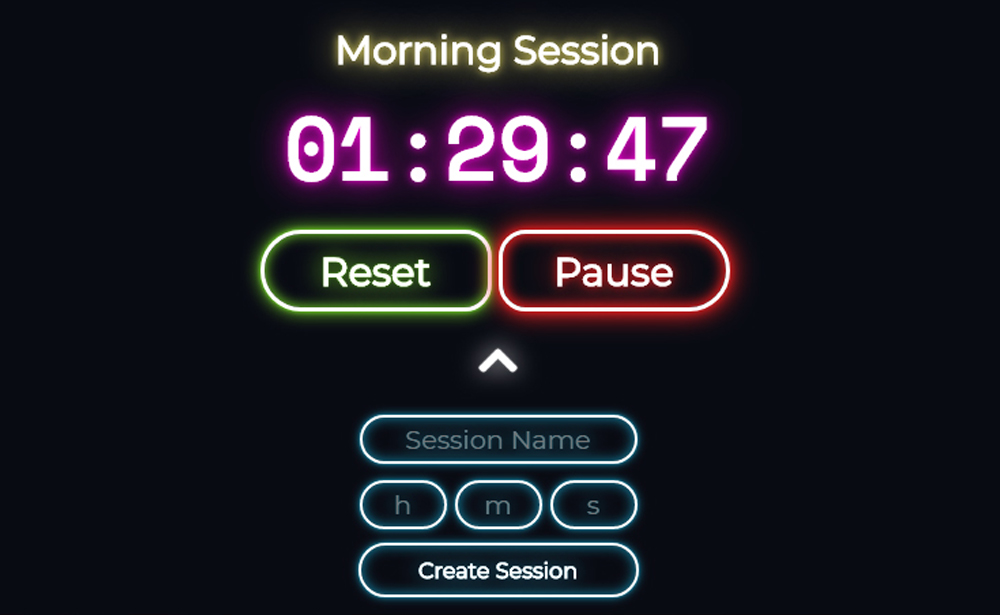
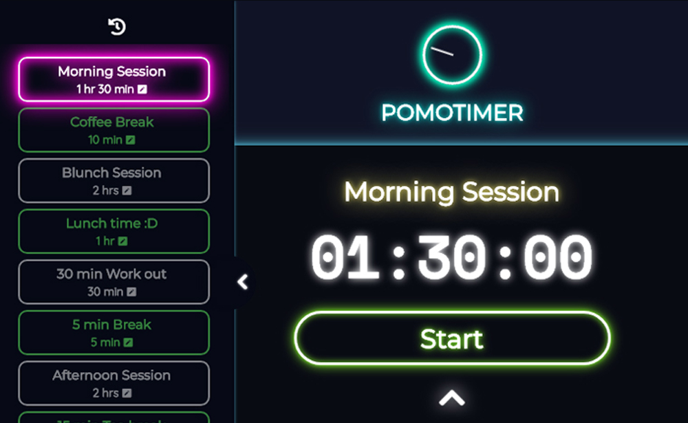
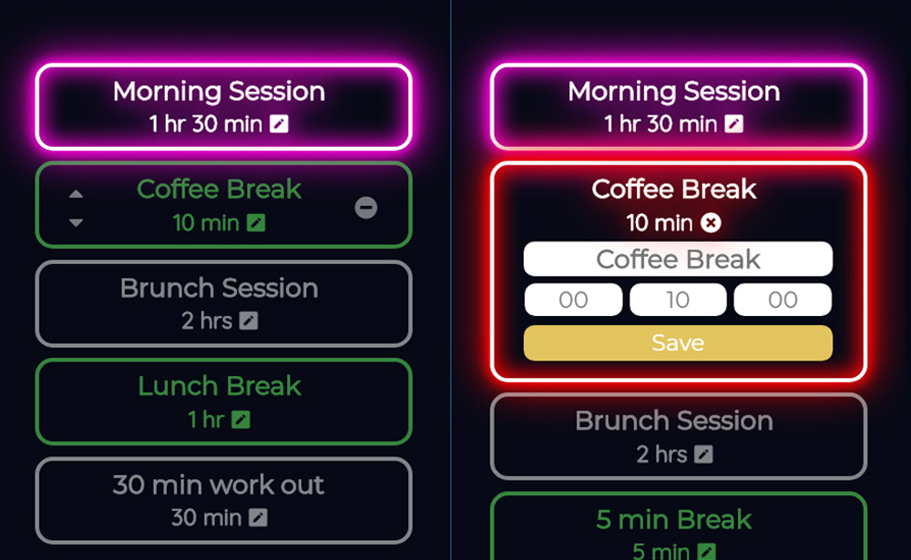

# Pomotimer
A time management application using ReactJS framework to provide works productivity and quality. balance your working and relaxing time and also help you to focus on current work during the sessions, keep your discipline ongoing. 

## User guide

#### Get start
Simply input your desire session name and time in session create form below and hit "Create Session" button.

The time will be in hour-minute-second format if no time and session name provide, the session time will be set to default 25 minutes and default name. Every new session create, the 5 minutes Break session will be added follow by the session which just create (Don't worry you can edit them later). 

User can also edit, rename session, re-order and delete upcoming session in popup navigation bar on the left side of the page. the 

## Version
v0.01

## Demo
You can checkout Pomotimer by follow this link [here](https://tatuu-pomotimer.netlify.com/). 

## Sending Feedback
I am always open to [your feedback](https://github.com/bakhumhlea/Bloc-Pomotimer/issues).